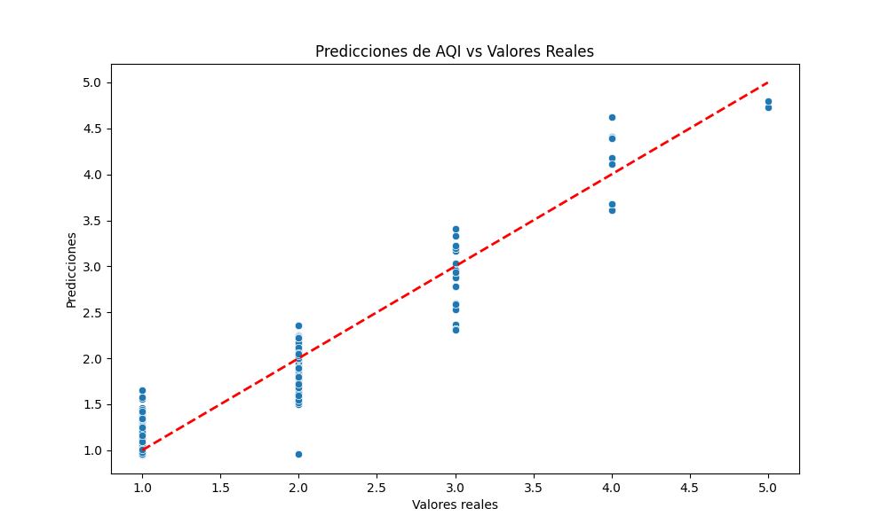

```{r setup, include=FALSE}
knitr::opts_chunk$set(echo = TRUE)
ipak <- function(pkg){ # funcion para instalar paquetes
  new.pkg <- pkg[!(pkg %in% installed.packages()[, "Package"])]
  if (length(new.pkg)) 
    install.packages(new.pkg, dependencies = TRUE)
  sapply(pkg, require, character.only = TRUE)
}
librerias <- c("httr","jsonlite","tidyverse","reticulate","lubridate","dplyr",
               "leaflet.extras","leaflet","plotly","readxl")
ipak(librerias)
api_key <- "34f37e6289a702e97dc704c6e2fcc6ca"  
start <- 1730419200  # 1 de noviembre de 2024
end <- 1730678399    # 3 de noviembre de 2024
```

# Portada

# Introducción

Estudio de la calidad del aire en zonas urbanas utilizando IoT

Hipótesis: Los sistemas de monitoreo de calidad del aire en tiempo real, basados en sensores IoT distribuidos en áreas urbanas, pueden ayudar a reducir la contaminación del aire al permitir respuestas rápidas y acciones de mitigación.

OpenWeather es una plataforma que proporciona servicios de datos meteorológicos, como pronósticos, clima actual y mapas, a través de una API.

Postman es una herramienta de desarrollo que permite enviar y gestionar solicitudes HTTP, facilitando pruebas y la interacción con APIs.

# Exploracion de Datos {.tabset .tabset-fade .tabset-pills}

## Codigo R

```{r}
# Lista de provincias con sus coordenadas (ejemplo para Costa Rica)
# Crear un data.frame con provincias, latitudes y longitudes
#ubicaciones <- data.frame(
 # ubicacion = c("San José"),
#  lat = c(9.93333),
#  lon = c(-84.08333)
#)
# Crea una lista para almacenar los datos de cada hoja
 #ubicaciones <-read_excel("cr.xlsx")

#ubicaciones <- ubicaciones %>% select(city,lat,lng)
#colnames(ubicaciones) <- c("ubicacion", "lat", "lon") 
#ubicaciones <- head(ubicaciones) 
ubicaciones <- data.frame(
  ubicacion = c("San Jose", "Alajuela", "Limon", "Liberia", "San Francisco", 
                "San Jose", "San Felipe", "San Miguel", "Puntarenas", "San Isidro", 
                "San Vicente", "San Pedro", "Cartago", "Heredia", "San Juan", 
                "Guadalupe", "San Pablo", "San Rafael", "Colima", "Concepcion"),
  lat = c(9.93333, 10.01625, 9.99074, 10.63504, 9.9938, 
          10.95192, 9.90444, 9.87121, 9.97691, 9.3674, 
          9.96194, 9.92829, 9.86444, 10.00236, 9.96188, 
          9.94805, 9.99559, 9.92826, 9.95532, 9.92683),
  lon = c(-84.08333, -84.21163, -83.03596, -85.43772, -84.12742, 
          -85.13572, -84.1062, -84.06084, -84.8379, -83.69713, 
          -84.0494, -84.05074, -83.91944, -84.11651, -84.07876, 
          -84.05665, -84.09656, -84.13537, -84.08235, -84.00123)
)


# Función para obtener los datos de calidad del aire
get_air_quality <- function(lat, lon, api_key, start, end, ubicacion) {
  # Generar la URL de la API
  url <- paste0("http://api.openweathermap.org/data/2.5/air_pollution/history?lat=", lat,
                "&lon=", lon, "&start=", start, "&end=", end, "&appid=", api_key)
  
   # Manejar la solicitud con tryCatch
  tryCatch({
    # Hacer la solicitud GET
    response <- GET(url,timeout(60))
    
    # Verificar el estado de la respuesta
    if (status_code(response) != 200) {
      warning(paste("Error en la solicitud para", ubicacion, 
                    "- Código de estado:", status_code(response)))
      return(NULL)  # Devolver NULL en caso de error
    }
    
    # Convertir la respuesta JSON a un objeto R
    air_quality <- fromJSON(content(response, "text", encoding = "UTF-8"))
    
    # Extraer la lista de componentes
    df_list <- air_quality$list
    
    # Crear un data frame combinando las columnas 'main' y 'components'
   df <- data.frame(
  ubicacion = ubicacion,
  lat = lat,
  lon= lon,
  aqi = df_list$main$aqi,
  co = df_list$components$co,
  no = df_list$components$no,
  no2 = df_list$components$no2,
  o3 = df_list$components$o3,
  so2 = df_list$components$so2,
  pm2_5 = df_list$components$pm2_5,
  pm10 = df_list$components$pm10,
  nh3 = df_list$components$nh3,
  dt = df_list$dt,
  stringsAsFactors = FALSE  # Asegurarse de que no convierta a factores
)
    
    return(df)
    
  }, error = function(e) {
    # Manejar el error y continuar
    warning(paste("Ocurrió un error para la ubicación:", ubicacion, "-", e$message))
    return(NULL)  # Devolver NULL en caso de error
  })
}


# Llamar a la función para obtener los datos de calidad del aire para cada ubicación
resultados <- lapply(1:nrow(ubicaciones), function(i) {
  get_air_quality(ubicaciones$lat[i], ubicaciones$lon[i], api_key, start, end,ubicaciones$ubicacion[i])
})

# Combinar los resultados en un solo data frame
df_resultados <- do.call(rbind, resultados)


# Usar reticulate para pasar los resultados de R a Python
resultados_py <- r_to_py(df_resultados)

print(head(df_resultados, 10))

```

## Codigo Python

```{r}
reticulate::py_install("pandas")
# Pasar la variable `resultados_py` al entorno de Python
py$results<- resultados_py
# Ejecutar el código Python correctamente dentro de py_run_string
# Ejecutar código Python dentro de R
reticulate::py_run_string("
import pandas as pd

# Convertir la lista de resultados de R en un DataFrame de Python
resultados_df = pd.DataFrame(results)

# Mostrar las primeras filas del DataFrame
print(resultados_df.head())
")
```

# Preprocesamiento de Datos

```{r}
df_resultados$dt <- as.POSIXct(df_resultados$dt, origin = "1970-01-01", tz = "UTC")

# 2. Limpieza de datos: eliminar filas con valores faltantes
df_resultados <- df_resultados %>%
  filter(!is.na(aqi) & !is.na(co) & !is.na(no) & 
         !is.na(no2) & !is.na(o3) & !is.na(so2) & 
         !is.na(pm2_5) & !is.na(pm10) & !is.na(nh3))

# 3. Opcional: convertir las ubicaciones a factores si es necesario
df_resultados$ubicacion <- as.factor(df_resultados$ubicacion)

# 4. Verificar los resultados
print(head(df_resultados, 10)) 

```

# Análisis Exploratorio de Datos {.tabset .tabset-fade .tabset-pills}

## Mapa de Calor

```{r}
#Unir DF con longitud y latitud


#Crear mapa de calor
mapa_calor <- leaflet(data = df_resultados) %>%
  addTiles() %>% 
  addHeatmap(
    lng = ~lon, lat = ~lat, 
    intensity = ~co, 
    blur = 5, 
    max = max(df_resultados$aqi, na.rm = TRUE), 
    radius = 15 
  )

#Llamada al mapa de calor
mapa_calor

```

## Grafico de barras

```{r}
# Grafico de barras
grafico <- ggplot(df_resultados, aes(x = ubicacion, y = aqi, fill = ubicacion)) +
  geom_bar(stat = "identity") +
  theme_minimal() +
  labs(title = "Niveles de AQI por Ubicación", y = "AQI", x = "Ubicación") +
  theme(axis.text.x = element_text(angle = 45, hjust = 1))

#Llamada al grafico de barras
grafico
```

## Grafico de dispersion

```{r}
# Gráfico de dispersion

grafico_dispersion<- plot_ly(df_resultados, x = ~no2, y = ~pm2_5, type = "scatter", mode = "markers", color = ~ubicacion) %>%
  layout(title = "Relación entre NO2 y PM2.5",
         xaxis = list(title = "no2"),
         yaxis = list(title = "pm2.5"))

#Llamada al grafico 
grafico_dispersion
```

# Integración con Python

# Modelado Predictivo

```{r}
# Instalar las librerías necesarias en Python
reticulate::py_install(c("pandas", "scikit-learn", "matplotlib", "seaborn"))

# Pasar la variable `resultados_py` al entorno de Python
py$results <- resultados_py

# Ejecutar el código Python para modelado predictivo
reticulate::py_run_string("
import matplotlib
# Establecer el backend antes de importar pyplot
matplotlib.use('Agg')  # Usa el backend no interactivo de matplotlib
import pandas as pd
from sklearn.model_selection import train_test_split
from sklearn.linear_model import LinearRegression
from sklearn.metrics import mean_squared_error, accuracy_score
import numpy as np
import matplotlib.pyplot as plt
import seaborn as sns

# Convertir la lista de resultados de R en un DataFrame de Python
resultados_df = pd.DataFrame(results)

# Limpiar los datos: eliminar filas con valores nulos
resultados_df.dropna(inplace=True)

# Definir las características (X) y la variable objetivo (y)
X = resultados_df[['co', 'no', 'no2', 'o3', 'so2', 'pm2_5', 'pm10', 'nh3']]
y = resultados_df['aqi']  # Usamos el índice de calidad del aire como variable objetivo

# Dividir los datos en conjuntos de entrenamiento y prueba
X_train, X_test, y_train, y_test = train_test_split(X, y, test_size=0.2, random_state=42)

# Crear y entrenar el modelo de regresión lineal
model = LinearRegression()
model.fit(X_train, y_train)

# Hacer predicciones
y_pred = model.predict(X_test)

# Calcular RMSE
rmse = np.sqrt(mean_squared_error(y_test, y_pred))
print(f'RMSE: {rmse}')

# Graficar los resultados
plt.figure(figsize=(10, 6))
sns.scatterplot(x=y_test, y=y_pred)
plt.plot([y.min(), y.max()], [y.min(), y.max()], 'r--', lw=2)
plt.xlabel('Valores reales')
plt.ylabel('Predicciones')
plt.title('Predicciones de AQI vs Valores Reales')
plt.savefig('plot.png')  # Guarda el gráfico como imagen
")

```



# Visualización Interactiva

# Conclusiones
